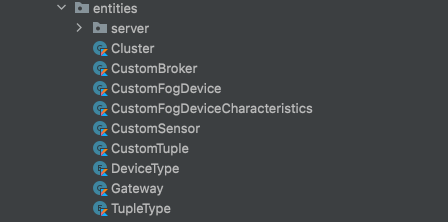
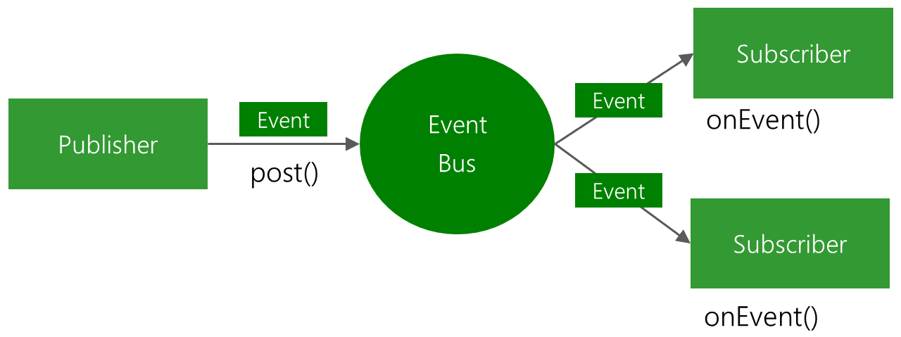
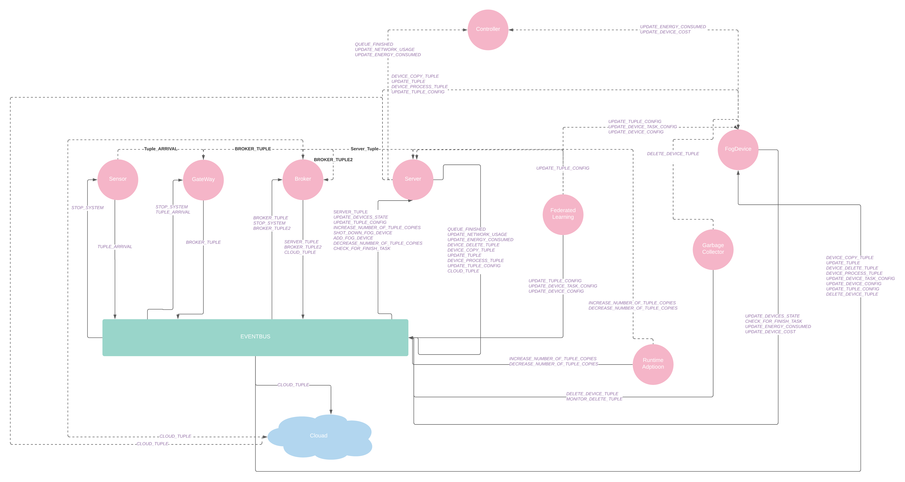

# Fog Simulator


## Languages
- Java
- Kotlin

## Frameworks
- Spring boot

## Technologies

- Socket
- Event bus
- OOP
- Singleton
- Clean Architecture
- Observable Pattern


## App Structure


in this project we create our structure based on clean Architecture and DDD. so we packaged our app based on feature.(package feature)

in this project we have 4 main package or directory:


## [Placement](https://github.com/MarsXan/FogDataPlacement/tree/master/src/main/kotlin/ir/fog/placement)


### [CustomController](https://github.com/MarsXan/FogDataPlacement/blob/master/src/main/kotlin/ir/fog/placement/CustomController.kt)

the main runner class in the app. this is using for starting the simulation and includes all the  entities. 

it includes 2 main function and initializer:

- init

```kotlin
init {}
```

in initialize function we add fog device in a list to add as available device in the server.

```kotlin
for (device in deviceList) {
        if (device is Server) {
            device.availableDevices = fogDevices
        }
    }
```

- start
```kotlin
fun start(){}
```
this function is used for starting the entities and event bus.

- startTimer()

```kotlin
private fun startTimer() {}
```

this function is a private function that used for add limit to simulation time. and stopping the system after specified time.


### [DataPlacement](https://github.com/MarsXan/FogDataPlacement/blob/master/src/main/kotlin/ir/fog/placement/DataPlacement.kt)

in this class we implement our main data placement algorithms and formulas that we discussed in article.

#### inputs:

```kotlin

class DataPlacement(
    var deviceList: List<CustomFogDevice?>,
    var tuple: CustomTuple,
    var SD: Double,
    var SMax: Double,
    var a1: Double,
    var a2: Double,
    var a3: Double,
    var a4: Double,
    var a5: Double,
    var FAva: Double,
    var FPar: Double,
    var normalizedCount: Double
)
```

- deviceList : list of available fog device inn the system.
- tuple: a small-scale data center that used for transferring data between entities
- SD: absolute size of data
- sMax: maximum allowed data size
- a1-a5 : Variables that are normalized between 0 and 1
- FAva: Data availability factor
- FPar: Parallelization factor

#### Methods:

- getContextAwareNumberOfCopies

```kotlin
fun getContextAwareNumberOfCopies(): Int {}
```
this function returns number of context aware copies that used in server for finding out the copies number.

- getNumberOfCopies

```kotlin
fun getNumberOfCopies(): Int {}
```

this function returns number of copies that used in server for finding out the copies number.

- getDataStorageLocation

```kotlin
fun getDataStorageLocation(
        device: CustomFogDevice, b1: Double, b2: Double,
        b3: Double, b4: Double, b5: Double,
        currentAttendanceTime: Double, devicePresenceMiddle: Double,
        devicesPresenceVariance: Double
    ): Double {}
```
within this function we find out which device have best match to copy the arrived tupple.


### [Task Placement](https://github.com/MarsXan/FogDataPlacement/blob/master/src/main/kotlin/ir/fog/placement/TaskPlacement.kt)

in this class we implement our main task placement algorithms and formulas that we discussed in article.

#### inputs:

```kotlin
class TaskPlacement(
    var device: CustomFogDevice? = null,
    var tuple: CustomTuple? = null,
    var b1: Double = 0.0,
    var b2: Double = 0.0,
    var b3: Double = 0.0
)
```

- deviceList : list of available fog device inn the system.
- tuple: a small-scale data center that used for transferring data between entities
- b1-a3 : Variables that are normalized between 0 and 1

#### Methods

```kotlin
fun getDeviceAvailability(): Double {}
```
this function returns each device availability for doing task. we use this function to find out best device for doing task.


## Entities



### Server

### Cluster

### CustomBroke


## Sequence Diagram


## Event Bus




## Entities




